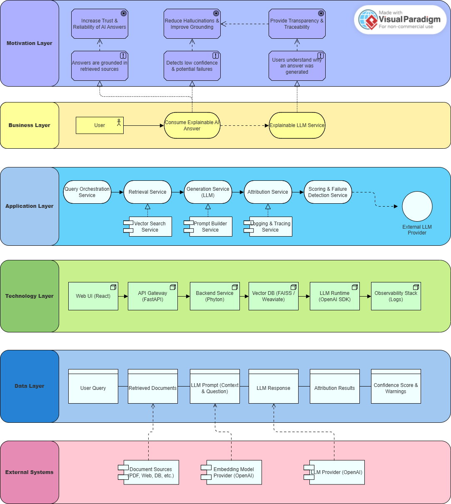

# Explainable LLM Pipeline

## Features
- Retrieval-Augmented Generation (RAG)
- Sentence-level attribution
- Confidence scoring
- Failure detection

## Run
```bash
py -m pip install -r requirements.txt
export OPENAI_API_KEY=your_key
uvicorn app.main:app --reload


## Endpoint
http://localhost:8000/ask?q=What
 is the capital of France?

## Goal
Make LLM outputs:
- transparent
- explainable
- measurable

## Architecture Overview

